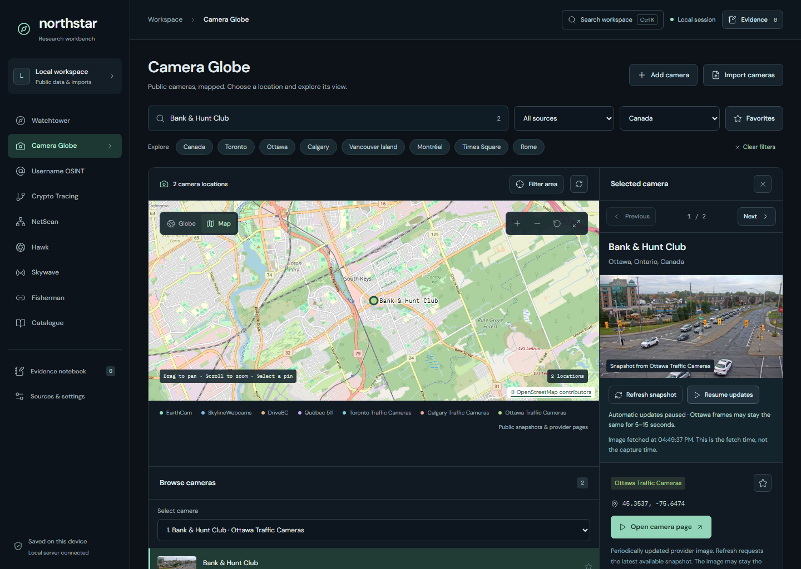

# OSINT Observatory

[](https://github.com/pouriamrt/osint-observatory/actions/workflows/ci.yml)


A local research workspace for public cameras, geospatial events, public-source lookups, and evidence notes. Explore a map, inspect a source, and keep your findings together on your own machine.



*Ottawa camera browsing. Map data © OpenStreetMap contributors; camera imagery from City of Ottawa, Traffic Services.*

## Highlights

- **Public camera explorer** — a globe and street map, searchable camera groups, persistent results, previous/next controls, and favorites.
- **Satellite views** — detailed streets-and-buildings imagery with street names, province/state borders and city labels, place/address search and city shortcuts; recent NASA/NOAA weather layers; mapped live street cameras, nearby traffic snapshots, current NASA ISS streams, and a clearly labeled recorded SkySat video.
- **Canadian coverage** — 2,708 bundled entries, including all 428 cameras in the Ottawa directory snapshot, plus Toronto, Calgary, Québec, and DriveBC.
- **Snapshot updates** — automatic and manual refresh, pause/resume, retained frames during failures, and explicit provider outage states.
- **Connected research tools** — geospatial events, public account lookups, transaction graphs, image metadata, spectrum plots, and registry searches.
- **Live radio** - Ottawa OPP/EMS listening links, a searchable local frequency directory with online audio links, authorized tab-audio capture with OpenAI transcripts and summaries, direct audio/HLS playback, and imported spectrum analysis.
- **Local evidence notebook** — save source details, retrieval times, and notes to SQLite; export your findings when ready.
- **Responsive interface** — desktop, tablet, mobile, keyboard workspace search, and fullscreen maps.

## Quick start

Requires **Node.js 24 or newer** and npm.

```sh
git clone https://github.com/pouriamrt/osint-observatory.git
cd osint-observatory
npm ci
npm run dev
```

Open **http://127.0.0.1:5173**. The API runs on **http://127.0.0.1:8787**.

Basic public-data and import workflows do not require provider keys. For optional integrations, copy `.env.example` to `.env`, configure the providers you use, and restart the app.

For a local build served on one port:

```sh
npm run build
npm start
```

Then open **http://127.0.0.1:8787**. The application binds to localhost and stores workspace data in `data/workbench.sqlite`.

## Workspace modules

| Module | What you can do |
| --- | --- |
| Camera Globe | Browse public cameras, street maps, snapshots, favorites, and imported media. |
| Satellite views | Explore streets and buildings, find a place or address, browse nearby street cameras, recent weather imagery, current NASA ISS streams, and recorded satellite video. |
| Watchtower | Explore earthquakes, natural hazards, and planetary K-index observations. |
| Username OSINT | Query supported public account sources and review platform links. |
| Crypto Tracing | Inspect Bitcoin transactions, supported EVM results, and imported transfer graphs. |
| NetScan | Run bounded DNS, certificate, and network checks within an authorized scope. |
| Hawk | Inspect image metadata, file hashes, and landmark-bearing calculations. |
| Skywave | Listen through Ottawa public-radio providers, browse local frequencies, transcribe authorized tab audio, analyze transcripts with AI, and inspect spectrum captures. |
| Fisherman | Create consent-based research links with optional browser geolocation. |
| Catalogue | Search LEI entities and browse curated registry sources. |
| Evidence notebook | Save findings, annotate evidence, and export your workspace. |

See the [detailed guide](docs/guide.md) for coverage boundaries, imports, camera sources, and provider configuration.

## Development

```sh
npm run check
npx playwright install chromium
npm run test:cameras:ui
npm run test:satellite:ui
npm run test:satellite:detail
npm run test:live-views:ui
npm run test:radio:ui
npm run test:radio:analysis:ui
```

`npm run check` builds the frontend and runs unit/integration tests. Camera browser checks use an isolated database and controlled network fixtures. GitHub Actions runs these checks on pushes and pull requests.

Satellite browser checks cover observation times, historical dates, automatic refresh, outages, retained imagery, responsive layouts, fullscreen, and both ISS player controls. They use an isolated database and controlled imagery/video fixtures.

With `npm run dev` running, `npm run test:streets:ui` checks map alignment, gestures, camera choices, tile outages, and desktop/mobile/fullscreen layouts. Automated map gestures use synthetic tile fixtures rather than public tile servers.

See [CONTRIBUTING.md](CONTRIBUTING.md) for the development workflow.

## Project layout

| Path | Contents |
| --- | --- |
| `src/` | React modules, shared components, and client utilities |
| `server/` | Express API, SQLite storage, provider integrations, and bundled catalogues |
| `public/` | Geographic boundaries, icons, and visitor-page assets |
| `scripts/` | Development tools, catalogue builders, and browser checks |
| `tests/` | Unit/integration tests and fixtures |
| `docs/` | Usage guide and selected screenshots |

## Data and attribution

Provider metadata keeps its source, attribution, licence, and retrieval time. Camera availability depends on the publisher; most road cameras provide periodic still images. Approximate positions and unavailable feeds are identified in the interface.

Street maps use [OpenStreetMap](https://www.openstreetmap.org/copyright) with visible attribution. Camera catalogues include [EarthCam](https://www.earthcam.com/mapsearch/), [SkylineWebcams](https://www.skylinewebcams.com/), and Canadian municipal/provincial traffic sources. Other integrations include USGS, NASA EONET, NOAA, GLEIF, and supported public account and blockchain APIs. Provider data and imagery retain their respective licences.

Satellite maps default to [Esri World Imagery](https://services.arcgisonline.com/ArcGIS/rest/services/World_Imagery/MapServer), with optional street labels and temporary place search through Esri. Satellite and aerial photographs can show streets and buildings; capture dates and resolution vary by location. [NASA GIBS](https://nasa-gibs.github.io/gibs-api-docs/) provides recent global VIIRS and regional GOES weather imagery. Weather zoom stops at native resolution and displays a prompt to switch to detailed imagery. All layers share the camera/event map projection. ISS video comes from [NASA's official station streams](https://www.youtube.com/playlist?list=PL2aBZuCeDwlQMf6xMgQAUAY_nbHAgW5jz); the player identifies live, recorded, or interrupted transmission. The app checks the official NASA and EarthCam stream listings every five minutes and follows replacement broadcast IDs. A failed check removes the live-status label without inventing coverage. Camera pins open video streams, snapshots, or provider pages according to source support. Planet’s public Dubai-airport SkySat video is a recorded example, not continuous live satellite surveillance.

Local databases, environment settings, planning documents, generated output, and test artifacts are excluded from Git. Saved evidence and imported files remain local until you export them.
